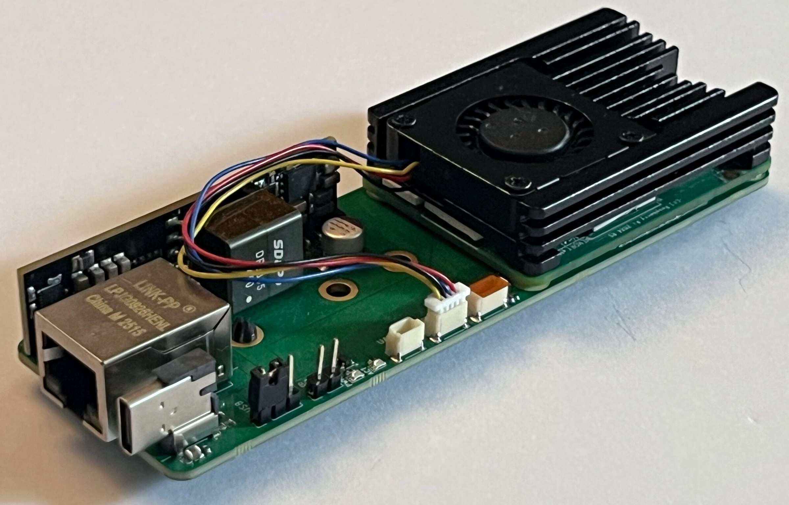

# CM4/CM5 Carrier Board V1

Production build of a compact carrier board for the Raspberry Pi Compute Module 4 and Compute Module 5. The board combines USB-C data and power, Ethernet, 25 W PoE input, M.2 storage and essential peripheral connections in a 120 mm × 40 mm form factor.

  

## Key Features

- Raspberry Pi Compute Module 4 and Compute Module 5 support
- Two 100-pin Hirose board-to-board connectors
- 120 mm × 40 mm board outline
- Six-layer PCB
- USB-C for data and 5 V at up to 3 A power input
- RJ45 Ethernet MagJack
- 25 W PoE powered-device input
- Jumper-selectable USB-C or PoE power input
- M.2 M-Key connector with support for 2230, 2242 and 2260 modules
- microSD card socket for Compute Module Lite variants
- 3-pin UART JST connector
- 3-pin I²C JST connector
- 3-pin PWM fan JST connector
- PWR and ACT indicator LEDs

## Power Input

The carrier board can be powered through either USB-C or PoE. The active input is selected using the onboard power-selection jumper.

The USB-C input provides 5 V at up to 3 A and uses CC pull-down resistors for source detection. The PoE interface operates as a 25 W powered device through the Ethernet connection.

## Storage

The M.2 M-Key interface supports 2230, 2242 and 2260 module sizes. A microSD card socket is provided for CM4 Lite and CM5 Lite variants without onboard eMMC storage.

## Peripheral Connections

UART, I²C and PWM fan connections are exposed through dedicated 3-pin JST connectors. PWR and ACT LEDs provide visible system-status indication.

## Repository Contents

This repository contains the KiCad design sources for the production V1 board, including:

- Schematic and PCB layout
- Project symbol and footprint libraries
- Component 3D models

## Opening the Project

1. Install [KiCad](https://www.kicad.org/).
2. Clone or download this repository.
3. Open `CM5Carrier.kicad_pro`.

## License

This hardware design is licensed under the [CERN Open Hardware Licence Version 2 – Permissive](LICENSE).

## Author

Designed by [Asad Imran](https://github.com/AsadImranRafique).
